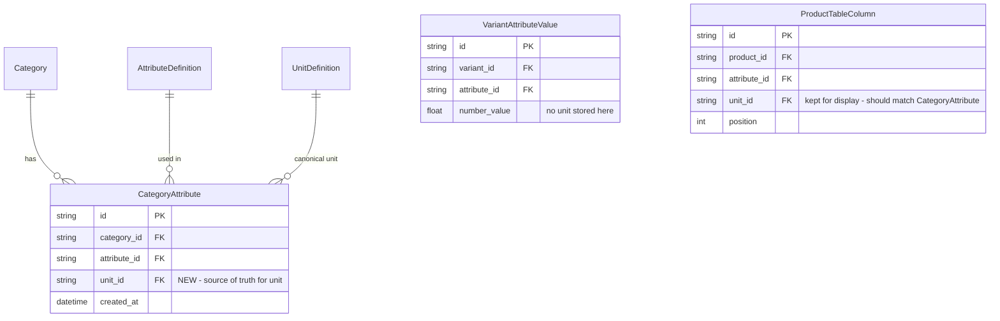
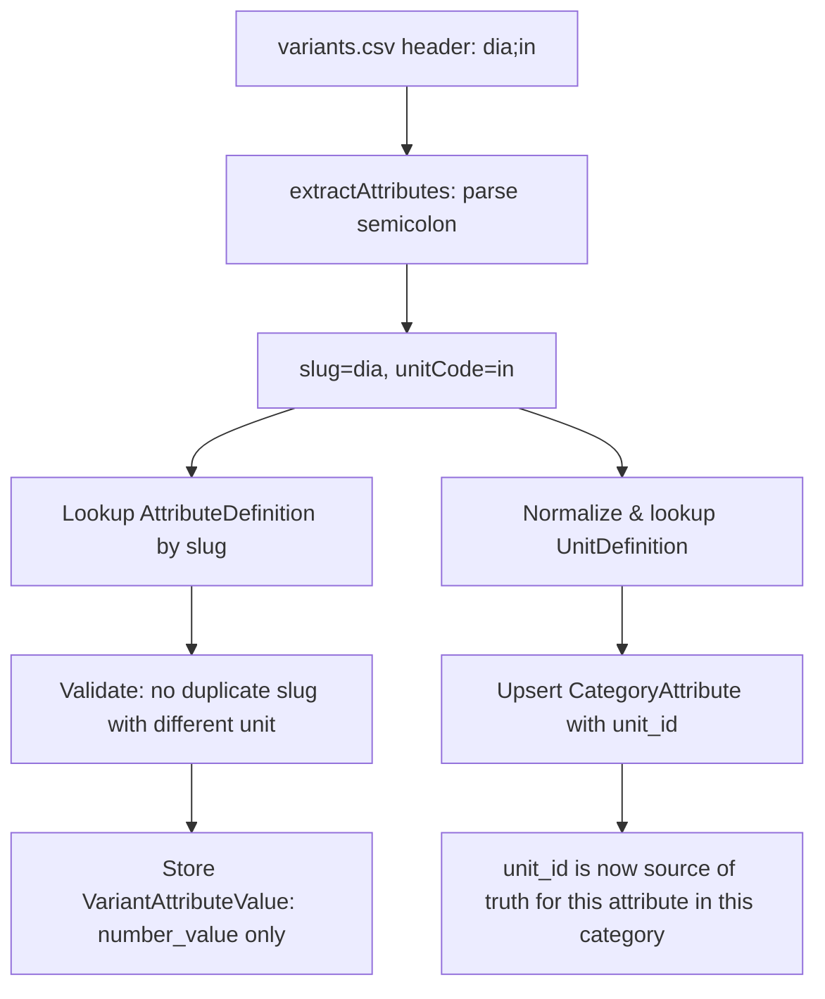

## Problem Summary

Currently, unit context is only stored in `ProductTableColumn` (UI display layer). `VariantAttributeValue` stores only `number_value` with no unit context. This means:
- Filtering/sorting numeric attributes is ambiguous (dia=25 in mm vs inch)
- No backend enforcement of unit consistency per product group

## Solution: Unit on CategoryAttribute

Add `unit_id` to the existing `CategoryAttribute` join table. This makes unit a property of "attribute within a category" — the natural scope for consistency.

### Architecture



### Data Flow



### Changes

#### 1. Schema: Add `unit_id` to `CategoryAttribute`

**File:** `apps/api/prisma/schema.prisma`

Add `unitId String? @map("unit_id")` and a relation to `UnitDefinition`. Add `@@unique([categoryId, attributeId])` (already exists). Run migration.

#### 2. Schema: Add `code` to `UnitDefinition`

**File:** `apps/api/prisma/schema.prisma`

Add `code String? @unique @map("code")` to `UnitDefinition`. The `code` is the normalized short form (e.g., `"in"`, `"mm"`, `"kg"`). The existing `name` stays as the display name (e.g., `"inches"`, `"millimeters"`).

Seed common units with codes. Add a `UNIT_ALIASES` map in the import service to normalize variants like `"inch"`, `"inches"`, `"\""` all to code `"in"`.

#### 3. Import: Parse semicolon headers in variants.csv

**File:** `apps/api/src/modules/import/services/catalog-import.service.ts`

Update `extractAttributes()` to split headers on `;`. The key in the returned map remains the slug (e.g., `"dia"`), but also return unit info. Actually — to keep it simple, `extractAttributes` should return both the slug-value map AND a separate map of `slug -> unitCode` from the headers.

This means the `VariantBatchItem.attributes` type stays as `Record<string, string>` (slug -> value), and we add a new `VariantBatchItem.headerUnits` field as `Record<string, string>` (slug -> unitCode from header).

#### 4. Import: Validate no duplicate attributes with different units

**File:** `apps/api/src/modules/import/services/catalog-import.service.ts`

During variant row processing, build a map of `attribute_slug -> unit_code` from the CSV headers. If the same slug appears with two different units, throw an error: `"Attribute 'dia' cannot have multiple units in the same product group"`.

#### 5. Import: Upsert `CategoryAttribute.unit_id` during batch processing

**File:** `apps/api/src/modules/import/services/catalog-import.service.ts`

In `processVariantBatch()`, after the existing `categoryAttributePairs` loop that upserts `CategoryAttribute` records, also include `unitId` in the upsert. The unit comes from the header parsing (step 3).

The upsert becomes:
```prisma
await prisma.categoryAttribute.upsert({
  where: { categoryId_attributeId: { categoryId, attributeId } },
  create: { categoryId, attributeId, unitId },
  update: { unitId },  // update unit if changed
});
```

#### 6. Import: Normalize unit codes via alias map

**File:** `apps/api/src/modules/import/services/catalog-import.service.ts`

Add a constant `UNIT_ALIASES` mapping:
```ts
const UNIT_ALIASES: Record<string, string> = {
  'inch': 'in', 'inches': 'in', '"': 'in',
  'millimeter': 'mm', 'millimeters': 'mm',
  'centimeter': 'cm', 'centimeters': 'cm',
  'meter': 'm', 'meters': 'm',
  'foot': 'ft', 'feet': 'ft',
  'kilogram': 'kg', 'kilograms': 'kg',
  'gram': 'g', 'grams': 'g',
  'pound': 'lb', 'pounds': 'lb',
  'ounce': 'oz', 'ounces': 'oz',
};
```

Use this when resolving unit from header: first normalize via alias, then look up `UnitDefinition` by `code`.

#### 7. Regenerate Prisma client

Run `pnpm --filter api prisma generate` after schema changes.

### What We Do NOT Change

- `VariantAttributeValue` — keeps `number_value` only, no unit stored per value
- `ProductTableColumn` — keeps `unit_id` for display, should match `CategoryAttribute.unit_id`
- No separate attributes per unit (no `dia_mm`, `dia_in`)
- No JSON/raw_value-only unit storage

### Final Answers

1. **Can the system distinguish between dia in mm vs inch?** YES — `CategoryAttribute.unit_id` provides the unit context per category
2. **Can filtering be done correctly?** YES — query `VariantAttributeValue.number_value` and join through `CategoryAttribute` to get the unit for correct comparisons
3. **Is schema still simple?** YES — one new nullable column on an existing join table
4. **Did we avoid per-value unit complexity?** YES — unit lives at the category-attribute level, not on each value