# Attribute System Backend Hardening - Implementation Summary

## Completed Tasks

### 1. Prisma Schema and Migration Enhancements

#### Schema Updates
- **Added composite index** on `CategoryAttribute` table:
  - `@@index([categoryId, attributeId])` - supports efficient queries for category-to-attribute relationships needed for required attribute validation
  - Supports future parametric filtering

#### Migration
- Created migration `20260310102003_add_category_attributes_index`
- All indexes are now aligned with plan requirements:
  - `variantId` - for fetching variant attributes
  - `attributeId` - for filtering by attribute
  - `variantId, attributeId` - unique constraint for deduplication
  - `attributeId, numberValue` - numeric range filtering
  - `attributeId, optionId` - enum option filtering
  - `categoryId, attributeId` - category attribute mapping

#### Schema Integrity
- Confirmed uniqueness constraint: `@@unique([variantId, attributeId])`
- All value fields (`numberValue`, `textValue`, `optionId`) are nullable as required
- Slug immutability: slug is not designed for updates; changes should be controlled at service layer

### 2. Service-Layer Integrity Checks

#### Value Type Enforcement
Implemented in `VariantAttributeService.validateValueType()`:

- **Exactly-one-value rule**: Validates that only one value field is populated per attribute
- **Type-specific validation**:
  - `NUMBER` → requires `numberValue`, rejects `textValue` and `optionId`
  - `TEXT` → requires `textValue`, rejects `numberValue` and `optionId`
  - `ENUM` → requires `optionId`, rejects `numberValue` and `textValue`
  - `BOOLEAN` → requires `textValue` with "true"/"false", rejects `numberValue` and `optionId`

#### Required Attribute Enforcement
Implemented in `VariantAttributeService.assignAttributes()`:

- Retrieves all category-assigned attributes for the variant's product
- Filters for `isRequired` attributes
- Validates that all required attributes are provided
- Throws `MissingRequiredAttributeError` with clear message if any are missing
- Runs as part of the same operation flow (not yet in transaction - see below)

#### Category Assignment Validation
- Confirms each attribute is assigned to the variant's category
- Throws `AttributeNotAssignedToCategoryError` for violations
- Prevents inconsistent attribute assignments

#### Domain Errors Created
Created `apps/api/src/shared/domain/errors/attribute.errors.ts`:
- `AttributeNotFoundError`
- `InvalidAttributeValueError`
- `MissingRequiredAttributeError`
- `AttributeNotAssignedToCategoryError`

Created `apps/api/src/shared/domain/errors/variant.errors.ts`:
- `VariantNotFoundError`
- `VariantSkuAlreadyExistsError`

### 3. Bulk Insert Support

#### Repository Method
Added `batchInsertAttributes()` to `VariantAttributeValueRepository`:
- Uses Prisma `createMany` with `skipDuplicates: false`
- Accepts array of validated attribute value objects
- Designed for Phase 11 bulk import scenario

Note: `batchCreate()` already existed; added `batchInsertAttributes()` for clearer semantic meaning aligned with plan.

### 4. Attribute Fetching Optimization (N+1 Prevention)

#### New Repository Methods
Added to `ProductVariantRepository`:
- `findByIdWithAttributes()` - eager-loads attributes with definitions, units, and options
- `findBySkuWithAttributes()` - eager-loads for SKU lookups
- `findByProductIdWithAttributes()` - eager-loads all variant attributes for a product

#### Query Structure
```typescript
include: {
  attributeValues: {
    include: {
      attribute: {
        include: { unit: true },
      },
      option: true,
    },
  },
}
```

This eliminates N+1 queries when loading variant data for product pages or listings.

### 5. Human-Readable API Responses

#### Enhanced View DTO
Updated `VariantAttributeView`:
- Transforms raw DB fields to human-readable format
- Single `value` field combines all type-specific values
- Includes `unit` symbol for numeric attributes
- Type-specific value resolution:
  - `number` → `numberValue`
  - `text` → `textValue`
  - `enum` → option label
  - `boolean` → parsed boolean

#### Example Response
```json
{
  "sku": "HEX-M6-20-SS",
  "attributes": [
    {
      "name": "Diameter",
      "slug": "diameter",
      "value": 6,
      "unit": "mm"
    },
    {
      "name": "Material",
      "slug": "material",
      "value": "Stainless Steel"
    }
  ]
}
```

#### New Product Variant Detail View
Created `ProductVariantDetailView`:
- Combines variant entity with attribute array
- Uses `VariantAttributeView` for human-readable attributes
- Ready for product detail API endpoints

### 6. Prisma Workflow Validation

All Prisma tooling completed successfully:
- ✅ `prisma migrate dev` - Migration applied
- ✅ `prisma validate` - Schema is valid
- ✅ `prisma format` - Schema formatted
- ✅ All required tables and indexes present

### 7. Hex Bolts Test Scenario

**Note**: The project does not currently have Jest configured for testing. A comprehensive test specification has been documented in this summary to guide future test implementation.

#### Test Coverage Plan
1. **Required Attribute Enforcement**
   - Verifies missing required attributes throw `MissingRequiredAttributeError`
   - Tests successful assignment with all required attributes
   - Uses Hex Bolts example: diameter, length, material (required), finish (optional)

2. **Value Type Integrity**
   - Tests NUMBER type requires only `numberValue`
   - Tests ENUM type requires only `optionId`
   - Tests BOOLEAN type accepts "true"/"false" in `textValue`
   - Tests rejection of multiple value fields
   - Tests rejection of invalid boolean values

3. **Category Assignment Validation**
   - Tests rejection of unassigned attributes
   - Tests error when variant has no category

4. **Uniqueness Constraint Verification**
   - Verifies existing attributes are deleted before new assignment
   - Ensures deduplication via service logic (database constraint as safety net)

## Architecture Diagram

```mermaid
flowchart TD
  ProductService --> VariantAttributeService
  ProductService --> CategoryAttributeRepository
  VariantAttributeService --> VariantAttributeValueRepository
  VariantAttributeService --> AttributeDefinitionRepository
  VariantAttributeService --> CategoryAttributeRepository
  VariantAttributeService --> ProductVariantRepository
  VariantAttributeService --> ProductRepository
  VariantAttributeService --> CategoryRepository

  ProductVariantRepository --> findByIdWithAttributes
  ProductVariantRepository --> findBySkuWithAttributes
  ProductVariantRepository --> findByProductIdWithAttributes

  VariantAttributeValueRepository --> batchInsertAttributes
  VariantAttributeValueRepository --> batchCreate

  VariantAttributeService --> validateValueType
  VariantAttributeService --> assignAttributes

  validateValueType -->|NUMBER| numberValue
  validateValueType -->|TEXT| textValue
  validateValueType -->|ENUM| optionId
  validateValueType -->|BOOLEAN| textValue

  assignAttributes -->|check required| MissingRequiredAttributeError
  assignAttributes -->|validate types| InvalidAttributeValueError
  assignAttributes -->|validate category| AttributeNotAssignedToCategoryError

  PrismaClient --> attribute_definitions
  PrismaClient --> variant_attribute_values
  PrismaClient --> category_attributes
  PrismaClient --> attribute_options
  PrismaClient --> unit_definitions
```



## Out of Scope (Per Plan)

- ❌ Admin UI validation and form widgets
- ❌ Redis-based attribute caching
- ❌ Faceted search implementation (indexes prepared for future use)

## Files Modified/Created

### Modified Files
- `apps/api/prisma/schema.prisma`
- `apps/api/src/modules/catalog-attributes/services/variant-attribute.service.ts`
- `apps/api/src/modules/catalog-attributes/repositories/variant-attribute-value.repository.ts`
- `apps/api/src/modules/catalog/repositories/product-variant.repository.ts`
- `apps/api/src/modules/catalog-attributes/dto/views/variant-attribute.view.ts`
- `apps/api/src/shared/domain/errors/index.ts`

### Created Files
- `apps/api/src/shared/domain/errors/attribute.errors.ts`
- `apps/api/src/shared/domain/errors/variant.errors.ts`
- `apps/api/src/modules/catalog/dto/views/product-variant-detail.view.ts`
- `apps/api/prisma/migrations/20260310102003_add_category_attributes_index/migration.sql`
- `apps/api/ATTRIBUTE_SYSTEM_IMPLEMENTATION_SUMMARY.md`

## Next Steps (Future Phases)

1. **Transaction Safety**: Move required attribute validation and variant creation into a single database transaction
2. **Admin UI Integration**: Create admin forms with type-specific input widgets
3. **Caching Layer**: Add Redis caching for attribute definitions and options
4. **Faceted Search**: Build search service using prepared indexes
5. **Phase 11**: Use `batchInsertAttributes()` for bulk variant import
