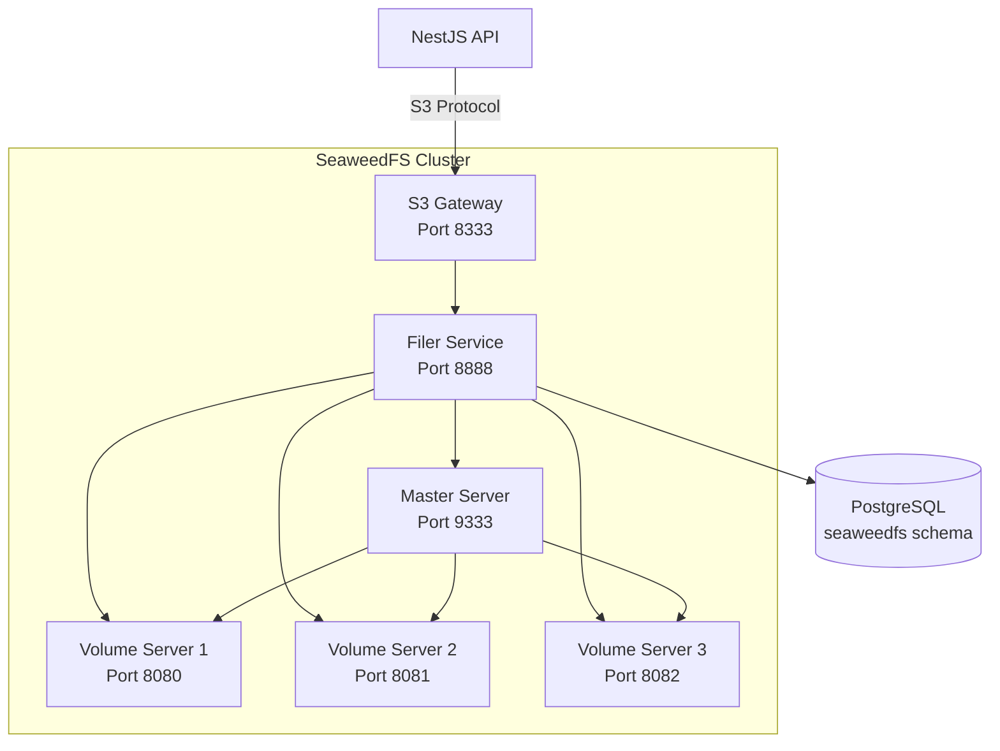

# SeaweedFS Setup Guide

## Overview

SeaweedFS is a fast distributed storage system for blobs, objects, files, and data. This guide covers the setup and usage of SeaweedFS 4.16 (latest version as of March 2026) in the DHT Hub project.

**Version**: 4.16 (released March 10, 2026)
**Architecture**: Distributed object storage with S3 compatibility
**Metadata Store**: PostgreSQL (dedicated `seaweedfs` schema)
**Replication**: 3 volume servers for redundancy

## Architecture



### Components

1. **Master Server** (`dht-seaweedfs-master`)
   - Port: 9333 (HTTP), 19333 (gRPC), 9324 (metrics)
   - Manages cluster coordination and volume allocation
   - Tracks topology and volume server locations

2. **Volume Servers** (`dht-seaweedfs-volume-1/2/3`)
   - Ports: 8080-8082 (HTTP), 18080-18082 (gRPC), 9325-9327 (metrics)
   - Store actual data chunks
   - 3 servers provide data redundancy and fault tolerance

3. **Filer Service** (`dht-seaweedfs-filer`)
   - Port: 8888 (HTTP), 18888 (gRPC), 9328 (metrics)
   - Manages file metadata and directory structure
   - Stores metadata in PostgreSQL `seaweedfs` schema

4. **S3 Gateway** (`dht-seaweedfs-s3`)
   - Port: 8333 (HTTP), 9329 (metrics)
   - Provides S3-compatible API
   - Translates S3 operations to SeaweedFS operations

## Quick Start

### 1. Configure Environment Variables

Copy the example environment file and configure:

```bash
cp .env.example .env
```

Update the following variables in your `.env` file:

```bash
# SeaweedFS Configuration
SEAWEDFS_S3_ACCESS_KEY=your_secure_access_key_here
SEAWEDFS_S3_SECRET_KEY=your_secure_secret_key_here
SEAWEDFS_S3_PORT=8333
SEAWEDFS_FILER_PORT=8888
SEAWEDFS_MASTER_PORT=9333
SEAWEDFS_VOLUME_PORT_START=8080

# SeaweedFS PostgreSQL Filer Store
SEAWEDFS_PG_SCHEMA=seaweedfs
SEAWEDFS_PG_HOST=dht-postgres
SEAWEDFS_PG_PORT=5432
SEAWEDFS_PG_USER=dht_admin
SEAWEDFS_PG_PASSWORD=your_secure_password
SEAWEDFS_PG_DB=dht_hub
```

### 2. Start SeaweedFS Services

```bash
docker-compose -f dht-docker-compose.yml up -d
```

This will start all SeaweedFS services in the correct order:
1. Master server
2. Volume servers (3 instances)
3. Filer service
4. S3 gateway

### 3. Initialize PostgreSQL Schema

Run the initialization script to create the dedicated schema:

```bash
chmod +x scripts/init-seaweedfs.sh
./scripts/init-seaweedfs.sh
```

This script will:
- Create the `seaweedfs` schema in PostgreSQL
- Grant necessary permissions
- Verify the schema creation
- Check cluster health
- Optionally create a default S3 bucket

### 4. Verify Installation

Check that all services are running:

```bash
# Check all containers
docker ps | grep seaweedfs

# Check master status
curl http://localhost:9333/cluster/status

# Check filer health
curl http://localhost:8888/healthz

# Check S3 gateway health
curl http://localhost:8333/healthz
```

## S3 API Usage

SeaweedFS provides a fully S3-compatible API through the S3 gateway.

### Using AWS CLI

Configure AWS CLI to use SeaweedFS:

```bash
export AWS_ACCESS_KEY_ID=your_s3_access_key
export AWS_SECRET_ACCESS_KEY=your_s3_secret_key
export AWS_DEFAULT_REGION=us-east-1
export AWS_ENDPOINT_URL=http://localhost:8333
```

#### Create a Bucket

```bash
aws s3 mb s3://my-bucket --endpoint-url=http://localhost:8333
```

#### Upload a File

```bash
aws s3 cp local-file.txt s3://my-bucket/remote-file.txt --endpoint-url=http://localhost:8333
```

#### List Buckets

```bash
aws s3 ls --endpoint-url=http://localhost:8333
```

#### List Objects in a Bucket

```bash
aws s3 ls s3://my-bucket --endpoint-url=http://localhost:8333
```

#### Download a File

```bash
aws s3 cp s3://my-bucket/remote-file.txt local-file.txt --endpoint-url=http://localhost:8333
```

#### Delete a File

```bash
aws s3 rm s3://my-bucket/remote-file.txt --endpoint-url=http://localhost:8333
```

### Using MinIO Client (mc)

Configure MinIO Client:

```bash
mc alias set dht http://localhost:8333 your_s3_access_key your_s3_secret_key
```

#### Create a Bucket

```bash
mc mb dht/my-bucket
```

#### Upload a File

```bash
mc cp local-file.txt dht/my-bucket/remote-file.txt
```

#### List Buckets

```bash
mc ls dht
```

#### List Objects in a Bucket

```bash
mc ls dht/my-bucket
```

#### Download a File

```bash
mc cp dht/my-bucket/remote-file.txt local-file.txt
```

### Using JavaScript/TypeScript (AWS SDK v3)

```typescript
import { S3Client, PutObjectCommand, GetObjectCommand, ListBucketsCommand } from '@aws-sdk/client-s3';

const s3Client = new S3Client({
  endpoint: 'http://localhost:8333',
  region: 'us-east-1',
  credentials: {
    accessKeyId: process.env.SEAWEDFS_S3_ACCESS_KEY!,
    secretAccessKey: process.env.SEAWEDFS_S3_SECRET_KEY!,
  },
  forcePathStyle: true, // Required for non-AWS S3 endpoints
});

// Upload a file
async function uploadFile(bucket: string, key: string, body: Buffer) {
  const command = new PutObjectCommand({
    Bucket: bucket,
    Key: key,
    Body: body,
  });
  
  await s3Client.send(command);
}

// List all buckets
async function listBuckets() {
  const command = new ListBucketsCommand({});
  const response = await s3Client.send(command);
  return response.Buckets;
}
```

## NestJS Integration

### Configuration

Update your NestJS service configuration to use SeaweedFS S3 endpoint:

```typescript
// config/storage.config.ts
export const storageConfig = {
  s3: {
    endpoint: process.env.SEAWEDFS_S3_ENDPOINT || 'http://localhost:8333',
    region: 'us-east-1',
    credentials: {
      accessKeyId: process.env.SEAWEDFS_S3_ACCESS_KEY!,
      secretAccessKey: process.env.SEAWEDFS_S3_SECRET_KEY!,
    },
    forcePathStyle: true,
  },
  bucket: process.env.SEAWEDFS_DEFAULT_BUCKET || 'dht-hub',
};
```

### Example Service

```typescript
// storage/storage.service.ts
import { Injectable } from '@nestjs/common';
import { S3Client, PutObjectCommand, DeleteObjectCommand, GetObjectCommand } from '@aws-sdk/client-s3';
import { Readable } from 'stream';

@Injectable()
export class StorageService {
  private readonly s3Client: S3Client;
  private readonly bucket: string;

  constructor() {
    this.s3Client = new S3Client({
      endpoint: process.env.SEAWEDFS_S3_ENDPOINT || 'http://localhost:8333',
      region: 'us-east-1',
      credentials: {
        accessKeyId: process.env.SEAWEDFS_S3_ACCESS_KEY!,
        secretAccessKey: process.env.SEAWEDFS_S3_SECRET_KEY!,
      },
      forcePathStyle: true,
    });
    this.bucket = process.env.SEAWEDFS_DEFAULT_BUCKET || 'dht-hub';
  }

  async uploadFile(key: string, file: Buffer | Readable, contentType?: string): Promise<string> {
    const command = new PutObjectCommand({
      Bucket: this.bucket,
      Key: key,
      Body: file,
      ContentType: contentType,
    });

    await this.s3Client.send(command);
    return `${this.bucket}/${key}`;
  }

  async deleteFile(key: string): Promise<void> {
    const command = new DeleteObjectCommand({
      Bucket: this.bucket,
      Key: key,
    });

    await this.s3Client.send(command);
  }

  async getFileUrl(key: string): Promise<string> {
    // For SeaweedFS, construct the URL based on your setup
    return `${process.env.SEAWEDFS_S3_ENDPOINT}/${this.bucket}/${key}`;
  }
}
```

## PostgreSQL Schema Details

SeaweedFS uses a dedicated PostgreSQL schema to store metadata. This provides several benefits:

### Why Separate Schema?

- **Cleaner Organization**: Storage metadata is isolated from application data
- **Easier Backups**: Can backup/restore SeaweedFS metadata independently
- **Better Security**: Granular permissions for storage vs application access
- **Simpler Migrations**: Schema migrations for storage don't affect app tables
- **No Naming Conflicts**: Prevents collisions between storage and application tables
- **Independent Rollbacks**: Can rollback storage schema without affecting application

### Schema Structure

Tables are created in the `seaweedfs` schema:

- `seaweedfs.filemeta` - File metadata (name, size, mime type, etc.)
- `seaweedfs.directory` - Directory structure
- `seaweedfs.kvstore` - Key-value storage for filer

### Viewing Schema Data

```bash
# Connect to PostgreSQL
docker exec -it dht-postgres psql -U dht_admin -d dht_hub

# List tables in seaweedfs schema
\dt seaweedfs.*

# Query file metadata
SELECT * FROM seaweedfs.filemeta LIMIT 10;

# Count files
SELECT COUNT(*) FROM seaweedfs.filemeta;
```

### Backing Up SeaweedFS Schema

```bash
# Backup only seaweedfs schema
docker exec dht-postgres pg_dump -U dht_admin -d dht_hub -n seaweedfs > seaweedfs-backup.sql

# Restore seaweedfs schema
docker exec -i dht-postgres psql -U dht_admin -d dht_hub < seaweedfs-backup.sql
```

## Monitoring and Health Checks

### Service Health

Check health status of all SeaweedFS services:

```bash
# Master server
curl http://localhost:9333/cluster/status

# Volume servers
curl http://localhost:8080/status
curl http://localhost:8081/status
curl http://localhost:8082/status

# Filer service
curl http://localhost:8888/healthz

# S3 gateway
curl http://localhost:8333/healthz
```

### Metrics Endpoints

All services expose metrics on dedicated ports:

- Master: http://localhost:9324/metrics
- Volume 1: http://localhost:9325/metrics
- Volume 2: http://localhost:9326/metrics
- Volume 3: http://localhost:9327/metrics
- Filer: http://localhost:9328/metrics
- S3 Gateway: http://localhost:9329/metrics

### Logs

View logs for specific services:

```bash
# All SeaweedFS services
docker-compose -f dht-docker-compose.yml logs -f seaweedfs

# Specific service
docker-compose -f dht-docker-compose.yml logs -f dht-seaweedfs-master
docker-compose -f dht-docker-compose.yml logs -f dht-seaweedfs-s3
```

## Troubleshooting

### Services Not Starting

1. **Check PostgreSQL is running**:
   ```bash
   docker ps | grep postgres
   ```

2. **Verify network connectivity**:
   ```bash
   docker network inspect dht-hub-network
   ```

3. **Check environment variables**:
   ```bash
   docker-compose -f dht-docker-compose.yml config
   ```

### Schema Not Created

If the `seaweedfs` schema wasn't created:

```bash
# Re-run initialization script
./scripts/init-seaweedfs.sh

# Or manually create schema
docker exec -it dht-postgres psql -U dht_admin -d dht_hub -c "CREATE SCHEMA IF NOT EXISTS seaweedfs;"
```

### S3 API Not Working

1. **Verify S3 gateway is running**:
   ```bash
   curl http://localhost:8333/healthz
   ```

2. **Check credentials**:
   - Verify `SEAWEDFS_S3_ACCESS_KEY` and `SEAWEDFS_S3_SECRET_KEY` are correct
   - Check they match the credentials configured in your application

3. **Test with AWS CLI**:
   ```bash
   export AWS_ACCESS_KEY_ID=your_key
   export AWS_SECRET_ACCESS_KEY=your_secret
   export AWS_ENDPOINT_URL=http://localhost:8333
   aws s3 ls --endpoint-url=http://localhost:8333
   ```

### Volume Servers Not Healthy

If volume servers are unhealthy:

```bash
# Check volume server status
curl http://localhost:8080/status

# Check master to see registered volumes
curl http://localhost:9333/vol/status

# Restart volume services
docker-compose -f dht-docker-compose.yml restart dht-seaweedfs-volume-1
docker-compose -f dht-docker-compose.yml restart dht-seaweedfs-volume-2
docker-compose -f dht-docker-compose.yml restart dht-seaweedfs-volume-3
```

### Data Not Persisting

If data is lost after restart:

1. **Verify volumes exist**:
   ```bash
   docker volume ls | grep seaweedfs
   ```

2. **Check volume mounts**:
   ```bash
   docker inspect dht-seaweedfs-volume-1 | grep Mounts
   ```

3. **Verify PostgreSQL schema**:
   ```bash
   docker exec -it dht-postgres psql -U dht_admin -d dht_hub -c "SELECT COUNT(*) FROM seaweedfs.filemeta;"
   ```

## Performance Tuning

### Volume Server Optimization

For large-scale deployments, consider adjusting these parameters in `dht-docker-compose.yml`:

```yaml
command: >
  volume
  -mserver="dht-seaweedfs-master:9333"
  -ip.bind=0.0.0.0
  -port=8080
  -metricsPort=9325
  -dataCenter=dc1
  -rack=rack1
  -compactionMBps=512
  -max=100
```

### Filer Optimization

```yaml
command: >
  filer
  -master="dht-seaweedfs-master:9333"
  -ip.bind=0.0.0.0
  -port=8888
  -metricsPort=9328
  -postgres.connection="postgresql://..."
  -maxMB=1000
  -disableHttp
```

### S3 Gateway Optimization

```yaml
command: >
  s3
  -filer="dht-seaweedfs-filer:8888"
  -ip.bind=0.0.0.0
  -port=8333
  -metricsPort=9329
  -accessKey=${SEAWEDFS_S3_ACCESS_KEY}
  -secretKey=${SEAWEDFS_S3_SECRET_KEY}
  -port.readTimeout=5s
  -port.writeTimeout=10s
  -port.idleTimeout=60s
```

## Migration from MinIO

If you're migrating from MinIO:

1. **Update application configuration**:
   - Change S3 endpoint from MinIO to SeaweedFS
   - Update port from 9000 to 8333
   - Use SeaweedFS access keys

2. **Update environment variables**:
   - Remove MinIO variables
   - Add SeaweedFS variables

3. **Migrate data** (optional):
   ```bash
   # Using AWS CLI to sync buckets
   aws s3 sync s3://minio-bucket s3://seaweedfs-bucket \
     --source-endpoint-url=http://localhost:9000 \
     --endpoint-url=http://localhost:8333
   ```

4. **Test thoroughly**:
   - Verify all S3 operations work
   - Check data integrity
   - Monitor performance

## Best Practices

1. **Use dedicated schema**: Always use the `seaweedfs` schema for metadata
2. **Regular backups**: Backup PostgreSQL `seaweedfs` schema regularly
3. **Monitor health**: Check service health endpoints periodically
4. **Scale volumes**: Add more volume servers for higher storage capacity
5. **Use S3 SDK**: Use standard AWS S3 SDK for application integration
6. **Secure credentials**: Use strong access keys and secrets
7. **Enable metrics**: Collect and analyze metrics for performance monitoring
8. **Test redundancy**: Verify data is replicated across volume servers

## Additional Resources

- [SeaweedFS Official Documentation](https://github.com/seaweedfs/seaweedfs)
- [SeaweedFS S3 Compatibility](https://github.com/seaweedfs/seaweedfs/tree/master/docker/s3)
- [AWS S3 SDK Documentation](https://aws.amazon.com/sdk-for-javascript/)

## Support

For issues or questions:
1. Check service logs: `docker-compose -f dht-docker-compose.yml logs -f seaweedfs`
2. Verify health endpoints
3. Review PostgreSQL schema: `\dt seaweedfs.*`
4. Check environment variables
