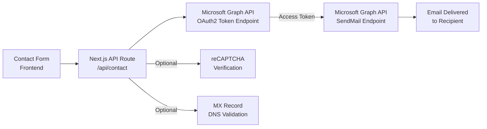

# Email Implementation Documentation

This document describes how email sending and contact form submission are implemented in the Tekhive web application using Microsoft Graph API with OAuth2 client credentials flow.

---

## 1. Architecture Overview

The contact form submission follows this pipeline:



### Key Components

| Component | File Path | Purpose |
|-----------|-----------|---------|
| Contact Form | `src/app/contact/page.tsx` | User-facing form with client-side validation |
| API Route | `src/app/api/contact/route.ts` | Server-side processing, email sending |
| Environment Config | `.env.local` | Stores Microsoft credentials and email settings |

---

## 2. Microsoft Entra ID (Azure AD) Setup

### Step 1: Create App Registration

1. Navigate to [Microsoft Entra admin center](https://entra.microsoft.com/)
2. Go to **Identity** > **Applications** > **App registrations**
3. Click **New registration**
4. Enter a name (e.g., "Tekhive Contact Form")
5. Select **Accounts in this organizational directory only** (Single tenant)
6. Click **Register**

### Step 2: Grant API Permissions

1. In the app registration, go to **API permissions**
2. Click **Add a permission** > **Microsoft Graph** > **Application permissions**
3. Search for and select **Mail.Send**
4. Click **Add permissions**
5. **Important:** Click **Grant admin consent for [Your Organization]** button
   - This is required for application permissions to take effect

### Step 3: Create Client Secret

1. Go to **Certificates & secrets** in your app registration
2. Click **New client secret**
3. Enter a description and select an expiration period
4. Click **Add**
5. **Copy the secret value immediately** - it will only be shown once

### Step 4: Record Required Values

From the app registration **Overview** page, note down:
- **Application (client) ID** -> This becomes `CLIENT_ID`
- **Directory (tenant) ID** -> This becomes `TENANT_ID`
- The secret value from Step 3 -> This becomes `CLIENT_SECRET`

---

## 3. Environment Variables

Configure the following variables in `.env.local`:

### Required Variables

```bash
# Microsoft Graph API Configuration
TENANT_ID=your-tenant-id-here
CLIENT_ID=your-client-id-here
CLIENT_SECRET=your-client-secret-here

# Email Settings
EMAIL_FROM=zsvconlineforms@tekhive.org
EMAIL_TO=info@tekhive.org
```

### Variable Descriptions

| Variable | Description | Example |
|----------|-------------|---------|
| `TENANT_ID` | Microsoft Entra tenant ID | `bc8892b4-ac7e-41a9-9c87-daffdbad0149` |
| `CLIENT_ID` | App registration application ID | `309b6a1e-7027-4c5d-b251-16b86e99f629` |
| `CLIENT_SECRET` | Client secret value from app registration | `C0B8Q~...` |
| `EMAIL_FROM` | Sender mailbox (must exist in tenant) | `zsvconlineforms@tekhive.org` |
| `EMAIL_TO` | Recipient email address | `info@tekhive.org` |

### Optional Variables (reCAPTCHA)

```bash
# Google reCAPTCHA v2 Configuration
NEXT_PUBLIC_RECAPTCHA_SITE_KEY=your-site-key
RECAPTCHA_SECRET_KEY=your-secret-key
NEXT_PUBLIC_SKIP_RECAPTCHA=true  # Set to 'true' for development/testing
```

---

## 4. API Route Implementation

Location: `src/app/api/contact/route.ts`

### Step 1: Obtain OAuth2 Access Token

The API uses the **client credentials flow** to authenticate with Microsoft Graph API:

```typescript
const tokenResponse = await fetch(
    `https://login.microsoftonline.com/${tenantId}/oauth2/v2.0/token`,
    {
        method: 'POST',
        headers: {
            'Content-Type': 'application/x-www-form-urlencoded',
        },
        body: new URLSearchParams({
            client_id: clientId,
            client_secret: clientSecret,
            scope: 'https://graph.microsoft.com/.default',
            grant_type: 'client_credentials',
        }),
    }
);

const tokenData = await tokenResponse.json();
const accessToken = tokenData.access_token;
```

### Step 2: Send Email via Microsoft Graph API

Use the access token to send email through the `/sendMail` endpoint:

```typescript
const sendMailResponse = await fetch(
    `https://graph.microsoft.com/v1.0/users/${senderEmail}/sendMail`,
    {
        method: 'POST',
        headers: {
            Authorization: `Bearer ${accessToken}`,
            'Content-Type': 'application/json',
        },
        body: JSON.stringify({
            message: {
                subject: `New Contact Form Submission from ${name}`,
                body: {
                    contentType: 'HTML',
                    content: emailContent,
                },
                toRecipients: [
                    {
                        emailAddress: {
                            address: recipientEmail,
                        },
                    },
                ],
                replyTo: [
                    {
                        emailAddress: {
                            address: email, // User's email for easy replies
                        },
                    },
                ],
            },
            saveToSentItems: false,
        }),
    }
);
```

### Key Implementation Details

- **Sender Email**: The `EMAIL_FROM` address must be a valid mailbox in your Microsoft 365 tenant (user mailbox or shared mailbox)
- **Reply-To**: Set to the form submitter's email for easy replies
- **saveToSentItems**: Set to `false` to avoid cluttering the sender's sent items

---

## 5. Contact Form Frontend

Location: `src/app/contact/page.tsx`

### Form State Management

```typescript
const [formData, setFormData] = useState({
    name: '',
    email: '',
    phone: '',
    service: '',
    message: '',
});
const [isSubmitting, setIsSubmitting] = useState(false);
const [submitStatus, setSubmitStatus] = useState<{
    type: 'success' | 'error' | null;
    message: string;
}>({ type: null, message: '' });
```

### Form Submission Handler

```typescript
const handleSubmit = async (e: React.FormEvent) => {
    e.preventDefault();
    
    // Client-side validation
    if (!formData.name || !formData.email || !formData.message) {
        setSubmitStatus({ type: 'error', message: 'Please fill in all required fields.' });
        return;
    }

    setIsSubmitting(true);

    try {
        const response = await fetch('/api/contact', {
            method: 'POST',
            headers: { 'Content-Type': 'application/json' },
            body: JSON.stringify(formData),
        });

        const data = await response.json();

        if (response.ok) {
            setSubmitStatus({ type: 'success', message: data.message });
            setFormData({ name: '', email: '', phone: '', service: '', message: '' });
        } else {
            setSubmitStatus({ type: 'error', message: data.error });
        }
    } catch (error) {
        setSubmitStatus({ type: 'error', message: 'Network error.' });
    } finally {
        setIsSubmitting(false);
    }
};
```

---

## 6. Validation Layers

### Client-Side Validation (Frontend)

| Field | Validation |
|-------|------------|
| Name | Required, non-empty |
| Email | Required, regex format check |
| Phone | Optional |
| Message | Required, non-empty |

Email regex pattern:
```typescript
const emailRegex = /^[^\s@]+@[^\s@]+\.[^\s@]+$/;
```

### Server-Side Validation (API Route)

1. **Required Fields Check**
   ```typescript
   if (!name || !email || !message || (!recaptchaToken && !skipRecaptcha)) {
       return NextResponse.json({ error: 'All fields are required' }, { status: 400 });
   }
   ```

2. **Email Format Validation**
   ```typescript
   const emailRegex = /^[^\s@]+@[^\s@]+\.[^\s@]+$/;
   if (!emailRegex.test(email)) {
       return NextResponse.json({ error: 'Invalid email format' }, { status: 400 });
   }
   ```

3. **MX Record DNS Validation**
   ```typescript
   import { resolveMx } from 'dns/promises';

   const domain = email.split('@')[1];
   const mxRecords = await resolveMx(domain);
   if (!mxRecords || mxRecords.length === 0) {
       return NextResponse.json({ error: 'Invalid email domain' }, { status: 400 });
   }
   ```

4. **reCAPTCHA Verification** (if enabled)

---

## 7. reCAPTCHA Integration

### Setup

1. Go to [Google reCAPTCHA Admin](https://www.google.com/recaptcha/admin)
2. Register a new site with reCAPTCHA v2 ("I'm not a robot" Checkbox)
3. Add your domains (include `localhost` for development)

### Environment Variables

```bash
# Public - used in frontend
NEXT_PUBLIC_RECAPTCHA_SITE_KEY=your-site-key

# Secret - used in backend only
RECAPTCHA_SECRET_KEY=your-secret-key

# Development bypass (remove in production!)
NEXT_PUBLIC_SKIP_RECAPTCHA=true
```

### Verification Flow

```typescript
const verifyUrl = 'https://www.google.com/recaptcha/api/siteverify';
const verifyResponse = await fetch(verifyUrl, {
    method: 'POST',
    headers: { 'Content-Type': 'application/x-www-form-urlencoded' },
    body: `secret=${secretKey}&response=${recaptchaToken}`,
});

const verifyData = await verifyResponse.json();
if (!verifyData.success) {
    return NextResponse.json({ error: 'reCAPTCHA verification failed' }, { status: 400 });
}
```

### Development Mode

Set `NEXT_PUBLIC_SKIP_RECAPTCHA=true` to bypass reCAPTCHA during development. **Remove this in production.**

---

## 8. Email Template Design

The email uses an HTML template with Tekhive branding:

```html
<!DOCTYPE html>
<html>
<head>
    <style>
        body { font-family: Arial, sans-serif; line-height: 1.6; color: #333; }
        .container { max-width: 600px; margin: 0 auto; padding: 20px; }
        .header { 
            background: linear-gradient(135deg, #2563eb 0%, #06b6d4 100%); 
            color: white; 
            padding: 20px; 
            border-radius: 8px 8px 0 0; 
        }
        .content { 
            background: #f9fafb; 
            padding: 20px; 
            border: 1px solid #e5e7eb; 
            border-top: none; 
        }
        .field { margin-bottom: 15px; }
        .label { font-weight: bold; color: #1f2937; }
        .value { 
            margin-top: 5px; 
            padding: 10px; 
            background: white; 
            border-radius: 4px; 
            border: 1px solid #e5e7eb; 
        }
        .footer { 
            background: #1f2937; 
            color: #9ca3af; 
            padding: 15px; 
            text-align: center; 
            border-radius: 0 0 8px 8px; 
            font-size: 12px; 
        }
    </style>
</head>
<body>
    <div class="container">
        <div class="header">
            <h2>New Contact Form Submission</h2>
        </div>
        <div class="content">
            <!-- Dynamic fields: Name, Email, Phone, Message -->
        </div>
        <div class="footer">
            <p>This email was sent from the Tekhive contact form</p>
        </div>
    </div>
</body>
</html>
```

### Template Features

- Gradient blue header with Tekhive branding
- Clean, readable content area with field labels
- Clickable email and phone links
- Dark footer with timestamp
- Responsive design (max-width: 600px)

---

## 9. Error Handling

### HTTP Status Codes

| Status Code | Condition |
|-------------|-----------|
| 200 | Success - email sent |
| 400 | Bad Request - validation failed |
| 500 | Server Error - configuration or email sending failed |

### Error Response Format

```typescript
// Error
{ "error": "Error message describing the issue" }

// Success
{ "success": true, "message": "Thank you for your message!" }
```

### Common Error Scenarios

| Error | Cause | Solution |
|-------|-------|----------|
| "All fields are required" | Missing form fields | Ensure all required fields are submitted |
| "Invalid email format" | Email regex fails | Check email format |
| "Invalid email domain" | No MX records found | Domain may not exist or DNS issue |
| "reCAPTCHA verification failed" | Invalid or expired token | User needs to retry |
| "Missing Microsoft Graph API credentials" | Env vars not set | Configure `.env.local` |
| "Failed to authenticate with Microsoft Graph API" | Invalid credentials | Verify tenant ID, client ID, and secret |
| "Failed to send email" | Graph API rejected request | Check permissions and sender mailbox |

---

## 10. Security Notes

### Credential Protection

- **Never commit `.env.local` to version control**
- All Microsoft credentials (`TENANT_ID`, `CLIENT_ID`, `CLIENT_SECRET`) are server-side only
- The `NEXT_PUBLIC_` prefix is only used for the reCAPTCHA site key (safe for client-side)

### API Security

- Microsoft Graph API calls are made server-side only
- Access tokens are short-lived and obtained fresh for each request
- Client secret is never exposed to the frontend

### Bot Protection

- reCAPTCHA v2 prevents automated bot submissions
- MX record validation prevents disposable/fake email domains

### Email Security

- Reply-to is set to the form submitter (not the sender)
- Sender email must be a valid mailbox in your tenant
- `saveToSentItems: false` prevents sent mail accumulation

### Recommendations

1. **Rotate client secrets periodically** (every 90-180 days)
2. **Monitor Azure AD sign-in logs** for suspicious activity
3. **Use least-privilege permissions** (only `Mail.Send` is needed)
4. **Enable conditional access policies** if available in your tenant
5. **Remove `NEXT_PUBLIC_SKIP_RECAPTCHA=true` in production**

---

## Quick Reference

### File Locations

```
src/
├── app/
│   ├── api/
│   │   └── contact/
│   │       └── route.ts      # API endpoint
│   └── contact/
│       └── page.tsx          # Contact form page
.env.local                    # Environment configuration
```

### Microsoft Graph API Endpoints

| Purpose | Endpoint |
|---------|----------|
| OAuth2 Token | `POST https://login.microsoftonline.com/{tenantId}/oauth2/v2.0/token` |
| Send Mail | `POST https://graph.microsoft.com/v1.0/users/{senderEmail}/sendMail` |

### Required API Permission

- `Mail.Send` (Application permission) with Admin Consent granted
